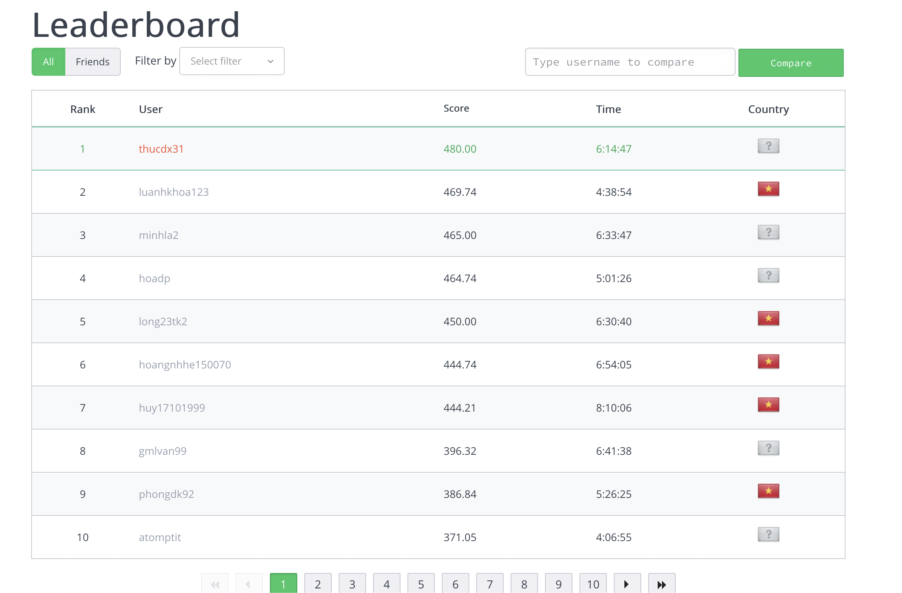

#### Solution for all problems in Viettel Code Challenge 2022.

All solutions get 100 scores

Link for contest:
https://www.hackerrank.com/contests/viettel-code-challenge-2022-bang-a/challenges

### Leaderboard

(mine is thucdx31)

### Algorithm

- A: Two Pointers or just for :-)
- B: Sorting
- C: DP: time_finish[task_a] = cost[task_a] + max(time_finish[task_i]) for all task_i that task_a depends on.
- D: Brute force + BFS. Don't use DFS because it will cause stack overflow
- E: Recursion + Bit manipulation to represent state of board 